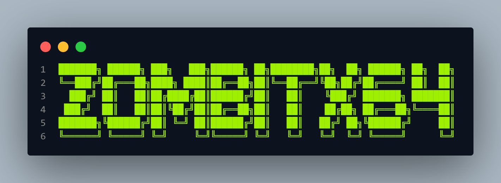

# zombitx64 - Advanced Web Scraping Tool

<div align="center">



[](https://www.python.org/downloads/)
[](LICENSE)
[](https://github.com/features/packages)

*A powerful web scraping and content analysis tool with AI integration*

</div>

## 📋 Table of Contents
- [zombitx64 - Advanced Web Scraping Tool](#zombitx64---advanced-web-scraping-tool)
  - [📋 Table of Contents](#-table-of-contents)
  - [Overview](#overview)
  - [📦 Releases](#-releases)
    - [Version 1.0.0 (Latest)](#version-100-latest)
    - [Version 0.9.0 (Beta)](#version-090-beta)
    - [Version 0.5.0 (Alpha)](#version-050-alpha)
  - [🚀 Key Features](#-key-features)
    - [🌐 Web Scraping Capabilities](#-web-scraping-capabilities)
    - [📝 Content Processing](#-content-processing)
    - [🤖 AI Integration](#-ai-integration)
    - [📊 Output Formats](#-output-formats)
  - [📁 Project Structure](#-project-structure)
    - [Core Components](#core-components)
  - [🛠️ Setup and Usage](#️-setup-and-usage)
    - [Installation Options](#installation-options)
      - [1. Install via GitHub Packages](#1-install-via-github-packages)
      - [2. Install from Source](#2-install-from-source)
    - [Environment Setup](#environment-setup)
    - [Running the Tool](#running-the-tool)
      - [Command Line Interface](#command-line-interface)
      - [Web Interface](#web-interface)
    - [Publishing to GitHub Packages](#publishing-to-github-packages)
  - [📤 Output Directory Structure](#-output-directory-structure)
  - [🔍 Features in Detail](#-features-in-detail)
    - [GitHub Repository Handling](#github-repository-handling)
    - [Content Processing Pipeline](#content-processing-pipeline)
    - [Error Handling](#error-handling)
  - [🤖 AI Integration](#-ai-integration-1)
  - [🌐 Web Interface Features](#-web-interface-features)
  - [⚠️ Important Notes](#️-important-notes)
  - [🔄 Future Improvements](#-future-improvements)
  - [👥 Contributing](#-contributing)
  - [📄 License](#-license)

## Overview
zombitx64 is a comprehensive web scraping and content analysis tool that combines multiple approaches to extract, process, and analyze web content. The project features both command-line and web-based interfaces, with special handling for GitHub repositories and integration with Mistral AI for content summarization.

## 📦 Releases

### Version 1.0.0 (Latest)
- Initial release with core functionality
- Web scraping capabilities
- Mistral AI integration
- Web interface implementation
- GitHub repository handling
- JSON and Markdown export

### Version 0.9.0 (Beta)
- Beta release with core features
- Basic web scraping
- Content processing pipeline
- Command-line interface

### Version 0.5.0 (Alpha)
- Alpha release for testing
- Basic HTML parsing
- File output handling
- Error handling implementation

## 🚀 Key Features

### 🌐 Web Scraping Capabilities
- **Intelligent Content Extraction**
  - HTML parsing with BeautifulSoup4
  - Special handling for GitHub repositories
  - Raw markdown file processing
  - Robots.txt compliance checking

### 📝 Content Processing
- **Smart Content Analysis**
  - Automatic content structure detection
  - Preservation of header hierarchy
  - List formatting (ordered and unordered)
  - Code block preservation
  - Link extraction and formatting

### 🤖 AI Integration
- **Mistral AI Integration**
  - Content summarization
  - Intelligent chunking for large content
  - Adaptive processing based on content size
  - Error handling with informative messages

### 📊 Output Formats
- **Flexible Export Options**
  - JSON output with metadata
  - Formatted Markdown output
  - Timestamped file organization
  - Structured content hierarchy

## 📁 Project Structure

### Core Components
1. **CrewNormalX64.py**
   - Basic web scraping functionality
   - HTML content extraction
   - Markdown formatting
   - File output handling

2. **CrewAPIX64.py**
   - Enhanced scraping capabilities
   - Mistral AI integration
   - GitHub-specific parsing
   - Advanced error handling

3. **Web Interface**
   - User-friendly interface for URL input
   - Result display with content preview
   - Download options for JSON/Markdown
   - Error feedback

## 🛠️ Setup and Usage

### Installation Options

#### 1. Install via GitHub Packages
```bash
# Configure pip to use GitHub Packages
pip install --upgrade pip
pip config set global.index-url https://npm.pkg.github.com

# Install the package
pip install zombitx64
```

To authenticate with GitHub Packages, you'll need to:
1. Create a Personal Access Token (PAT) with `read:packages` scope
2. Configure pip to use your PAT:
```bash
pip config set global.username YOUR_GITHUB_USERNAME
pip config set global.password YOUR_GITHUB_PAT
```

#### 2. Install from Source
```bash
# Clone the repository
git clone [repository-url]
cd [repository-name]

# Install required packages
pip install -r requirements.txt
```

### Environment Setup
- Create a `.env` file in the project root
- Add your Mistral AI API key:
  ```
  MISTRAL_API_KEY=your_api_key_here
  ```

### Running the Tool

#### Command Line Interface
```bash
# Basic scraping
python -m zombitx64.normal

# Advanced scraping with AI
python -m zombitx64.api
```

#### Web Interface
```bash
# Start the web server
python -m zombitx64.app
```

### Publishing to GitHub Packages
For contributors who want to publish new versions:

1. Update version in `setup.py`
2. Build the package:
```bash
python -m build
```

3. Publish to GitHub Packages:
```bash
python -m twine upload --repository github dist/*
```

Note: You need appropriate permissions and a PAT with `write:packages` scope to publish.

## 📤 Output Directory Structure
```
scraped_output/
├── scraped_[timestamp].json  # JSON format output
└── scraped_[timestamp].md    # Markdown format output
```

## 🔍 Features in Detail

### GitHub Repository Handling
- Repository metadata extraction
- README.md content parsing
- Description and structure preservation
- Support for both main and master branches

### Content Processing Pipeline
1. URL validation and robots.txt checking
2. Content extraction and structure analysis
3. AI-powered summarization (when enabled)
4. Formatted output generation

### Error Handling
- Comprehensive error catching
- Informative error messages
- Fallback mechanisms for different scenarios
- API rate limit handling

## 🤖 AI Integration

The tool uses Mistral AI for content summarization with the following features:
- Automatic content chunking for large texts
- Progressive summarization for multi-chunk content
- Detailed progress tracking
- Error recovery mechanisms

## 🌐 Web Interface Features
- Clean and intuitive user interface
- Real-time scraping feedback
- Content preview functionality
- Direct file download options

## ⚠️ Important Notes
- Ensure proper API key configuration in `.env`
- Respect robots.txt guidelines
- Monitor rate limits for API calls
- Check output directory permissions

## 🔄 Future Improvements
- Additional output format support
- Enhanced error recovery
- Multiple AI provider support

## 👥 Contributing
Contributions are welcome! Please feel free to submit a Pull Request. For major changes, please open an issue first to discuss what you would like to change.

1. Fork the repository
2. Create your feature branch (`git checkout -b feature/AmazingFeature`)
3. Commit your changes (`git commit -m 'Add some AmazingFeature'`)
4. Push to the branch (`git push origin feature/AmazingFeature`)
5. Open a Pull Request

## 📄 License
This project is licensed under the MIT License - see the [LICENSE](LICENSE) file for details.
