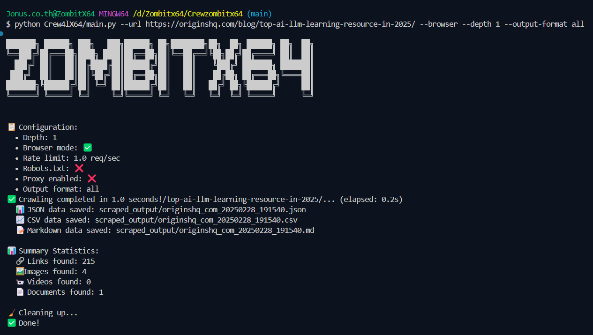
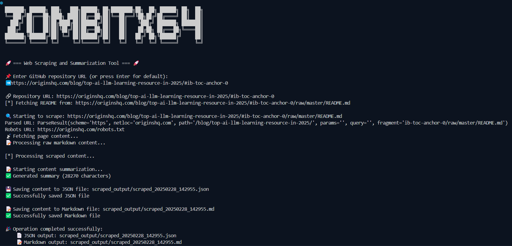

<div align="center">


[](https://www.python.org/downloads/)
[](LICENSE)
[](https://github.com/features/packages)
[](https://github.com/JonusNattapong/Crewzombitx64/stargazers)

*A powerful web scraping and content analysis tool with AI integration*

</div>

## 📋 Table of Contents

- [📋 Table of Contents](#-table-of-contents)
- [Overview](#overview)
- [📦 Releases](#-releases)
  - [Version 1.2.3 (Latest)](#version-123-latest)
  - [Version 1.2.2](#version-122)
  - [Version 1.2.1](#version-121)
  - [Version 1.2.0](#version-120)
  - [Version 1.1.0](#version-110)
  - [Version 1.0.0](#version-100)
  - [Version 0.9.0 (Beta)](#version-090-beta)
  - [Version 0.5.0 (Alpha)](#version-050-alpha)
- [🚀 Key Features](#-key-features)
  - [🌐 Web Scraping Capabilities](#-web-scraping-capabilities)
  - [🔒 Security and Compliance](#-security-and-compliance)
  - [📝 Content Processing](#-content-processing)
  - [📊 Output Formats](#-output-formats)
- [📁 Project Structure](#-project-structure)
  - [Core Components](#core-components)
- [Installation](#installation)
- [Running the Tool](#running-the-tool)
  - [Available Versions](#available-versions)
  - [Web Interface](#web-interface)
  - [Choosing the Right Version](#choosing-the-right-version)
- [Publishing to GitHub Packages](#publishing-to-github-packages)
- [📤 Output Directory Structure](#-output-directory-structure)
- [🔍 Features in Detail](#-features-in-detail)
  - [Advanced Capabilities](#advanced-capabilities)
  - [Content Processing Pipeline](#content-processing-pipeline)
- [🤖 Content Analysis](#-content-analysis)
- [⚠️ Important Notes](#️-important-notes)
- [🔄 Future Improvements](#-future-improvements)
- [👥 Contributing](#-contributing)
- [Inspiration](#inspiration)
- [📄 License](#-license)
- [Star History](#star-history)





## Overview

**Crewzombitx64** is a comprehensive web scraping and content analysis tool designed to extract, process, and analyze web content efficiently. It supports both command-line and web-based interfaces, with special handling for GitHub repositories and integration with Mistral AI for advanced content summarization.

**Key Features:**
- Intelligent content extraction with BeautifulSoup4
- Advanced proxy management and rate limiting
- Robust security and compliance features
- Multiple output formats (JSON, Markdown)
- Integration with Mistral AI for content analysis
- User-friendly web interface for easy access and configuration

## 📦 Releases

### Version 1.2.3 (Latest)

- **Enhanced Legal Compliance**:
  - Improved robots.txt compliance with detailed error handling
  - Terms of Service warning system for each domain
  - PDF permission warnings and checks
  - GDPR compliance warnings and personal data detection
  - Copyright protection warnings and content scanning
  - One-time warning system to avoid duplicates
  - Smart content analysis for personal and copyrighted material
  - Improved data protection measures

### Version 1.2.2

- **Enhanced GitHub repository integration**
  - Repository metadata extraction
  - README parsing improvements
  - Directory tree visualization
  - File content handling enhancements

### Version 1.2.1

- **Browser Mode Improvements**
  - Fixed async/sync operations
  - Enhanced error handling
  - Improved resource cleanup

### Version 1.2.0

- **Enhanced Security and Legal Compliance**:
  - Improved sensitive data detection (API keys, passwords, tokens)
  - Strict URL validation and hostname checking
  - Advanced robots.txt compliance system
  - Protected access to sensitive paths and admin panels
  - Extended internal network protection

- **Advanced Proxy Management**:
  - Intelligent proxy rotation based on performance
  - Proxy health monitoring and scoring
  - Automatic removal of poor performers
  - Response time tracking
  - Proxy anonymity verification

- **Adaptive Rate Limiting**:
  - Domain-specific rate controls
  - Automatic backoff on errors
  - Burst control with configurable limits
  - Response time monitoring
  - Per-domain request tracking

- **Enhanced Configuration System**:
  - Comprehensive security defaults
  - Privacy-focused settings
  - Legal compliance options
  - Random user agent rotation
  - Input validation and sanitization
  - Request limits and error thresholds

### Version 1.1.0

- **Google Colab Integration**:
  - Easy-to-use notebook interface
  - Cloud-based execution support
  - Interactive examples and tutorials

- **Advanced Web Scraping Implementation**:
  - LLM-powered schema generation using OpenAI/Ollama
  - Automatic CSS and XPath schema generation
  - Comprehensive documentation and examples
  - Parallel processing and performance optimizations
  - Enhanced JSON extraction with JSONPath support
  - Complex JSONPath, JSON-CSS, and Microdata extraction
  - SSL certificate handling with custom paths
  - Enhanced security features
  - Async/await support for better concurrency
  - Improved media extraction
  - Document type detection
  - Lazy loading support
  - Responsive image handling

### Version 1.0.0

- **Initial Release**:
  - Core web scraping functionality
  - Mistral AI integration
  - Web interface implementation
  - GitHub repository handling
  - JSON and Markdown export
  - Basic HTML content extraction
  - Markdown formatting
  - File output handling

### Version 0.9.0 (Beta)

- **Beta Release**:
  - Core web scraping features
  - Basic content processing pipeline
  - Command-line interface

### Version 0.5.0 (Alpha)

- **Alpha Release**:
  - Basic HTML parsing
  - File output handling
  - Error handling implementation

## 🚀 Key Features

### 🌐 Web Scraping Capabilities

- **Intelligent Content Extraction**:
  - HTML parsing with BeautifulSoup4
  - Special handling for GitHub repositories
  - Raw markdown file processing
  - Advanced robots.txt compliance system
  - Strict URL validation and hostname checking
  - Protected access controls for sensitive paths

### 🔒 Security and Compliance

- **Data Protection**:
  - Advanced sensitive data detection and redaction
  - Automatic detection of API keys, passwords, and tokens
  - Secure handling of credentials and sensitive information
  - Improved personal data identification (GDPR compliance)
  - Copyright content detection and warnings
  - PDF permission checking system
  - Terms of Service compliance alerts

- **Access Control**:
  - Extended internal network protection
  - Strict URL validation and filtering
  - Protected access to sensitive paths

- **Network Security**:
  - Intelligent proxy rotation with performance scoring
  - Automatic removal of poor-performing proxies
  - Response time monitoring and optimization

- **Legal Compliance**:
  - Enhanced robots.txt compliance with error handling
  - Rate limiting with domain-specific controls
  - Privacy-focused configuration defaults
  - GDPR compliance warnings and checks
  - Copyright protection system
  - Document permission verification
  - Terms of Service warning system
  - One-time warning mechanism

### 📝 Content Processing

- **Smart Content Analysis**:
  - Automatic content structure detection
  - Preservation of header hierarchy
  - List formatting (ordered and unordered)
  - Code block preservation
  - Link extraction and formatting

### 📊 Output Formats

- **Flexible Export Options**:
  - JSON output with metadata
  - Formatted Markdown output
  - Timestamped file organization
  - Structured content hierarchy

## 📁 Project Structure

### Core Components

1. **CrewColabX64.ipynb**:
   - **Description**: Google Colab notebook for cloud-based execution
   - **Features**:
     - Interactive interface and cloud execution
     - Built-in tutorials and documentation
     - No local setup required
     - Ideal for quick starts and learning

2. **CrewNormalX64.py**:
   - **Description**: Standard version without API requirements
   - **Features**:
     - Basic web scraping with BeautifulSoup4
     - Local text summarization (NLTK)
     - GitHub repository handling
     - JSON/Markdown output
     - No API key needed

3. **CrewAPIX64.py**:
   - **Description**: Enhanced version with Mistral AI integration
   - **Features**:
     - Advanced AI summarization
     - Intelligent content chunking
     - Enhanced summary quality
     - Improved GitHub parsing
     - Requires API key

4. **Crew4lX64.py**:
   - **Description**: Advanced version with comprehensive features
   - **Features**:
     - Browser integration for dynamic content
     - Advanced data extraction
     - Media handling
     - Enhanced security
     - Legal compliance controls

5. **Web Interface**:
   - **Description**: Flask-based GUI
   - **Features**:
     - User-friendly interface
     - Real-time feedback
     - Content preview
     - Direct file downloads
     - Easy configuration

## Installation

1. **Clone the Repository**:
   ```bash
   git clone https://github.com/yourusername/zombitx64.git
   cd zombitx64
   ```

2. **Create Virtual Environment**:
   ```bash
   python -m venv venv
   source venv/bin/activate  # On Linux/macOS
   venv\Scripts\activate  # On Windows
   ```

3. **Install Dependencies**:
   ```bash
   pip install -r requirements.txt
   ```

4. **Configure**:
   - Create `.env` file with required API keys

## Running the Tool

### Available Versions

1. **Standard Version (CrewNormalX64.py)**:
   ```bash
   python CrewNormalX64.py
   ```
   - Basic web scraping
   - No API key required
   - Local text analysis

2. **API Version (CrewAPIX64.py)**:
   ```bash
   python CrewAPIX64.py
   ```
   - AI-powered analysis
   - Requires Mistral API key
   - Enhanced features

3. **Advanced Version (Crew4lX64.py)**:
   ```bash
   python Crew4lX64/main.py --url <target_url> [options]
   ```
   - Browser integration
   - Advanced features
   - Comprehensive controls

   **Options**:
   ```
   --url <target_url>      Required: Target URL
   --depth <integer>       Crawl depth (default: 1)
   --browser              Enable browser mode
   --headless            Headless browser mode
   --scroll              Auto-scroll pages
   --output-format       'json' or 'md' (default: 'json')
   --rate-limit         Requests per second
   --proxy              Proxy URL
   --verbose            Detailed output
   ```

### Web Interface

Launch the web interface:
```bash
python -m zombitx64.app
```

### Choosing the Right Version

- **Standard Version**: Basic scraping, no API needed
- **API Version**: Advanced AI features, requires key
- **Advanced Version**: Complex tasks, browser integration
- **Colab Version**: Cloud-based, interactive learning

## Publishing to GitHub Packages

1. Update version in `setup.py`
2. Build: `python -m build`
3. Publish: `python -m twine upload --repository github dist/*`

## 📤 Output Directory Structure

```
scraped_output/
├── scraped_[timestamp].json
└── scraped_[timestamp].md
```

## 🔍 Features in Detail

### Advanced Capabilities

- **Markdown Generation**: Clean, structured output
- **Data Extraction**: Schema-based, flexible patterns
- **Browser Integration**: Anti-detection, session management
- **Media Handling**: Comprehensive format support
- **Security**: Robust protection and compliance
- **Error Handling**: Recovery and fallbacks

### Content Processing Pipeline

1. URL validation and robots.txt
2. Content extraction
3. AI analysis (if enabled)
4. Output formatting

## 🤖 Content Analysis

- **API Version**: Mistral AI powered
- **Standard Version**: NLTK based
- **Features**: 
  - Content chunking
  - Summarization
  - Keyword analysis
  - Progress tracking

## ⚠️ Important Notes

- Configure API keys properly
- Follow robots.txt rules
- Monitor rate limits
- Check permissions

## 🔄 Future Improvements

- More output formats
- Enhanced recovery
- Additional AI providers

## 👥 Contributing

1. Fork repository
2. Create feature branch
3. Commit changes
4. Submit pull request

## Inspiration

This project was inspired by the [unclecode/crawl4ai](https://github.com/unclecode/crawl4ai) repository. It provided valuable insights and ideas that helped shape the development of `Crewzombitx64`.

## 📄 License

MIT License - See [LICENSE](LICENSE) file

## Star History

[](https://star-history.com/#JonusNattapong/Crewzombitx64&Date)