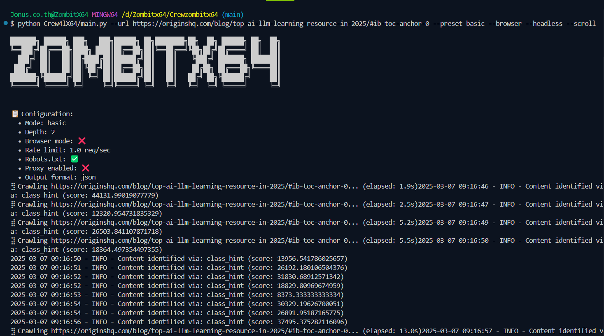
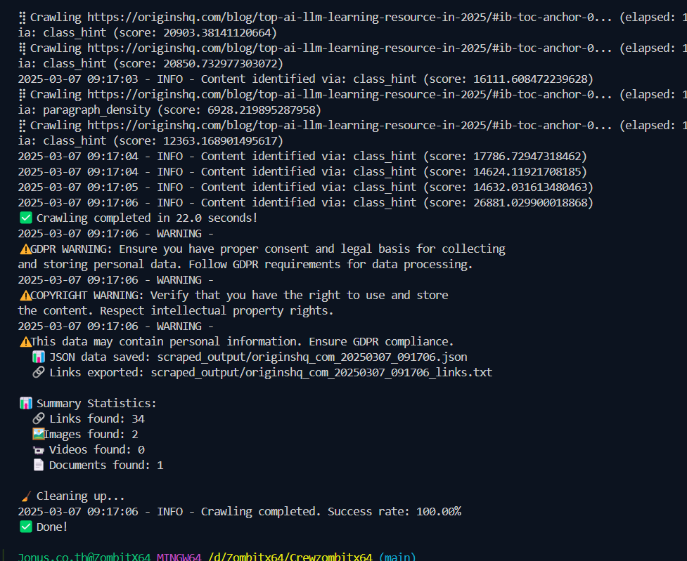

# Crewzombitx64

<div align="center">


[](https://www.python.org/downloads/)
[](LICENSE)
[](https://github.com/features/packages)
[](https://github.com/JonusNattapong/Crewzombitx64/stargazers)

*A powerful web scraping and content analysis tool with AI integration*

</div>

## ⚠️ คำเตือน (Warning)

- **ข้อกำหนดการใช้งาน (Terms of Service)**: โปรดตรวจสอบข้อกำหนดการใช้งานของเว็บไซต์ที่คุณกำลังรวบรวมข้อมูล
- **robots.txt**: ปฏิบัติตามกฎ `robots.txt` อย่างเคร่งครัด
- **GDPR**: ระมัดระวังข้อมูลส่วนบุคคลและปฏิบัติตาม GDPR
- **ลิขสิทธิ์ (Copyright)**: ตรวจสอบลิขสิทธิ์ของเนื้อหาและหลีกเลี่ยงการละเมิด
- **สิทธิ์การเข้าถึง (Permissions)**: ตรวจสอบสิทธิ์ในการเข้าถึงและรวบรวมข้อมูล

## สารบัญ

- [Crewzombitx64](#crewzombitx64)
  - [⚠️ คำเตือน (Warning)](#️-คำเตือน-warning)
  - [สารบัญ](#สารบัญ)
  - [ภาพรวม (Overview)](#ภาพรวม-overview)
    - [การติดตั้ง](#การติดตั้ง)
    - [การใช้งาน](#การใช้งาน)
    - [การตั้งค่าสำเร็จรูป](#การตั้งค่าสำเร็จรูป)
    - [โหมดโต้ตอบ](#โหมดโต้ตอบ)
    - [🚀 คุณสมบัติหลัก](#-คุณสมบัติหลัก)
    - [🌐 ความสามารถในการรวบรวมข้อมูลเว็บ](#-ความสามารถในการรวบรวมข้อมูลเว็บ)
    - [🔒 ความปลอดภัยและการปฏิบัติตามข้อกำหนด](#-ความปลอดภัยและการปฏิบัติตามข้อกำหนด)
    - [📝 การประมวลผลเนื้อหา](#-การประมวลผลเนื้อหา)
    - [📊 รูปแบบผลลัพธ์](#-รูปแบบผลลัพธ์)
  - [📁 โครงสร้างโปรเจกต์](#-โครงสร้างโปรเจกต์)
    - [องค์ประกอบหลัก](#องค์ประกอบหลัก)
  - [การติดตั้ง](#การติดตั้ง-1)
  - [การใช้งานเครื่องมือ](#การใช้งานเครื่องมือ)
    - [เวอร์ชันที่มีให้](#เวอร์ชันที่มีให้)
    - [เว็บอินเตอร์เฟส](#เว็บอินเตอร์เฟส)
    - [การเลือกเวอร์ชันที่เหมาะสม](#การเลือกเวอร์ชันที่เหมาะสม)
  - [📤 โครงสร้างไดเรกทอรีผลลัพธ์](#-โครงสร้างไดเรกทอรีผลลัพธ์)
  - [🔍 รายละเอียดคุณสมบัติ](#-รายละเอียดคุณสมบัติ)
    - [ความสามารถขั้นสูง](#ความสามารถขั้นสูง)
    - [ขั้นตอนการประมวลผลเนื้อหา](#ขั้นตอนการประมวลผลเนื้อหา)
  - [🤖 การวิเคราะห์เนื้อหา](#-การวิเคราะห์เนื้อหา)
  - [⚠️ หมายเหตุสำคัญ](#️-หมายเหตุสำคัญ)
  - [🔄 การปรับปรุงในอนาคต](#-การปรับปรุงในอนาคต)
  - [👥 การมีส่วนร่วม](#-การมีส่วนร่วม)
  - [แรงบันดาลใจ](#แรงบันดาลใจ)
  - [📄 สัญญาอนุญาต](#-สัญญาอนุญาต)
  - [ประวัติ Star](#ประวัติ-star)

## ภาพรวม (Overview)





**Crewzombitx64** เป็นเครื่องมือรวบรวมข้อมูลจากเว็บไซต์ (Web Crawler) ที่ออกแบบมาเพื่อดึงข้อมูลจากแหล่งต่างๆ บนเว็บอย่างมีประสิทธิภาพและมีความรับผิดชอบ เครื่องมือนี้มีความสามารถหลากหลาย:

- **การรวบรวมข้อมูล**: ดึงข้อมูลจากหน้าเว็บ, GitHub repositories และไฟล์ Markdown
- **การประมวลผลเนื้อหา**: แยกและจัดรูปแบบเนื้อหา, จัดการโครงสร้าง Markdown
- **ความปลอดภัย**: ตรวจจับและจัดการข้อมูลที่ละเอียดอ่อน, ปฏิบัติตาม robots.txt
- **การปฏิบัติตามข้อกำหนด**: แจ้งเตือน GDPR, ลิขสิทธิ์ และสิทธิ์การเข้าถึง
- **รูปแบบผลลัพธ์**: รองรับ JSON และ Markdown

### การติดตั้ง

```bash
pip install -r requirements.txt
```

### การใช้งาน

**Crew4lX64** เป็นเครื่องมือรวบรวมข้อมูลจากเว็บไซต์ (Web Crawler) ที่มีความสามารถหลากหลาย สามารถปรับแต่งได้ตามความต้องการของผู้ใช้ ทั้งการใช้งานแบบพื้นฐานและการใช้งานขั้นสูง

**ตัวเลือก (Options)**:

```
ตัวเลือกพื้นฐาน:
--url <target_url>     URL เป้าหมายที่ต้องการรวบรวมข้อมูล
--interactive          เปิดโหมดการตั้งค่าแบบโต้ตอบ
--preset              ใช้การตั้งค่าสำเร็จรูป (basic, aggressive, stealth, api, archive)
--depth <integer>     ความลึกในการรวบรวมข้อมูล (ค่าเริ่มต้น: 2)
--output-format       รูปแบบไฟล์ผลลัพธ์ (json, csv, md, หรือ all) (ค่าเริ่มต้น: json)
--output-dir         ไดเรกทอรีสำหรับเก็บไฟล์ผลลัพธ์ (ค่าเริ่มต้น: scraped_output)

ตัวเลือกขั้นสูง:
--browser            เปิดใช้งานการแสดงผลด้วยเบราว์เซอร์
--headless          เรียกใช้เบราว์เซอร์ในโหมดไม่มีส่วนติดต่อผู้ใช้ (headless mode)
--wait-time         ระยะเวลารอสำหรับการโหลดเนื้อหาแบบไดนามิก (ค่าเริ่มต้น: 2.0 วินาที)
--scroll            เปิดใช้งานการเลื่อนหน้าจออัตโนมัติสำหรับการโหลดแบบไดนามิก
--rate-limit        จำนวนคำขอต่อวินาที (ค่าเริ่มต้น: 1.0)
--retry-count       จำนวนครั้งในการลองใหม่สำหรับคำขอที่ล้มเหลว (ค่าเริ่มต้น: 3)
--retry-delay       ระยะเวลาหน่วงระหว่างการลองใหม่ (หน่วยเป็นวินาที) (ค่าเริ่มต้น: 1.0)
--proxies           ไฟล์ที่มีรายการพร็อกซี (หนึ่งรายการต่อบรรทัด)
--user-agents       ไฟล์ที่มีรายการ User Agent (หนึ่งรายการต่อบรรทัด)
--respect-robots    เคารพกฎ robots.txt
```

### การตั้งค่าสำเร็จรูป

เครื่องมือนี้มีการตั้งค่าสำเร็จรูปสำหรับกรณีการใช้งานทั่วไป:

1.  **Basic** (ค่าเริ่มต้นที่ปลอดภัย):
    -   ความลึกและอัตราการจำกัดปานกลาง
    -   ไม่ใช้พร็อกซี
    -   การจัดการข้อผิดพลาดพื้นฐาน
    -   เหมาะสำหรับการรวบรวมข้อมูลเว็บไซต์อย่างง่าย

2.  **Aggressive** (ประสิทธิภาพสูง):
    -   ความลึกสูงกว่าและอัตราการจำกัดต่ำกว่า
    -   เปิดใช้งานการรองรับพร็อกซี
    -   โหมด Burst เพื่อการรวบรวมข้อมูลที่เร็วขึ้น
    -   เหมาะสำหรับการรวบรวมข้อมูลขนาดใหญ่

3.  **Stealth** (เน้นความเป็นส่วนตัว):
    -   อัตราการจำกัดต่ำกว่า
    -   รองรับพร็อกซีพร้อมการหมุนเวียน
    -   คุณสมบัติความเป็นส่วนตัวขั้นสูง
    -   เหมาะสำหรับการดำเนินการที่ละเอียดอ่อน

4.  **API** (ปรับให้เหมาะสมกับ REST API):
    -   ความลึกเดียว
    -   การจำกัดอัตราที่สอดคล้องกัน
    -   ไม่ใช้พร็อกซีโดยค่าเริ่มต้น
    -   ปรับให้เหมาะสมสำหรับปลายทาง API

5.  **Archive** (การรวบรวมข้อมูลเชิงลึก):
    -   ความลึกสูงสุด
    -   ขีดจำกัดขนาดไฟล์ที่ใหญ่ขึ้น
    -   การบันทึกข้อผิดพลาดที่ครอบคลุม
    -   ออกแบบมาเพื่อวัตถุประสงค์ในการเก็บถาวร

### โหมดโต้ตอบ

โหมดโต้ตอบใหม่มอบวิธีที่เป็นมิตรกับผู้ใช้ในการกำหนดค่าโปรแกรมรวบรวมข้อมูล:

1.  เปิดด้วยแฟล็ก `--interactive`
2.  เลือกวัตถุประสงค์ในการรวบรวมข้อมูลจากค่าที่ตั้งไว้ล่วงหน้า
3.  เลือกรูปแบบผลลัพธ์
4.  กำหนดค่าตัวเลือกขั้นสูงหากจำเป็น
5.  เริ่มการรวบรวมข้อมูลด้วยการตั้งค่าที่ปรับให้เหมาะสม

ตัวอย่าง:

```bash
python Crew4lX64/main.py --interactive
```

### 🚀 คุณสมบัติหลัก

### 🌐 ความสามารถในการรวบรวมข้อมูลเว็บ

-   **การแยกเนื้อหาอัจฉริยะ**:
    -   การแยกวิเคราะห์ HTML ด้วย BeautifulSoup4
    -   การจัดการพิเศษสำหรับ GitHub repositories
    -   การประมวลผลไฟล์ Markdown ดิบ
    -   ระบบปฏิบัติตาม robots.txt ขั้นสูง
    -   การตรวจสอบ URL ที่เข้มงวดและการตรวจสอบชื่อโฮสต์
    -   การควบคุมการเข้าถึงที่ได้รับการป้องกันสำหรับเส้นทางที่ละเอียดอ่อน

### 🔒 ความปลอดภัยและการปฏิบัติตามข้อกำหนด

-   **การปกป้องข้อมูล**:
    -   การตรวจจับและแก้ไขข้อมูลที่ละเอียดอ่อนขั้นสูง
    -   การตรวจจับคีย์ API, รหัสผ่าน และโทเค็นโดยอัตโนมัติ
    -   การจัดการข้อมูลประจำตัวและข้อมูลที่ละเอียดอ่อนอย่างปลอดภัย
    -   การระบุข้อมูลส่วนบุคคลที่ได้รับการปรับปรุง (การปฏิบัติตาม GDPR)
    -   การตรวจจับเนื้อหาลิขสิทธิ์และการแจ้งเตือน
    -   ระบบตรวจสอบสิทธิ์ PDF
    -   การแจ้งเตือนการปฏิบัติตามข้อกำหนดในการให้บริการ
-   **การควบคุมการเข้าถึง**:
    -   การป้องกันเครือข่ายภายในเพิ่มเติม
    -   การตรวจสอบและกรอง URL อย่างเข้มงวด
    -   การเข้าถึงเส้นทางที่ละเอียดอ่อนที่ได้รับการป้องกัน
-   **ความปลอดภัยของเครือข่าย**:
    -   การหมุนเวียนพร็อกซีอัจฉริยะตามประสิทธิภาพ
    -   การลบพร็อกซีที่มีประสิทธิภาพต่ำโดยอัตโนมัติ
    -   การตรวจสอบเวลาตอบสนองและการเพิ่มประสิทธิภาพ
-   **การปฏิบัติตามกฎหมาย**:
    -   การปฏิบัติตาม robots.txt ที่ได้รับการปรับปรุงพร้อมการจัดการข้อผิดพลาด
    -   การจำกัดอัตราด้วยการควบคุมเฉพาะโดเมน
    -   ค่าเริ่มต้นการกำหนดค่าที่เน้นความเป็นส่วนตัว
    -   การแจ้งเตือนและการตรวจสอบการปฏิบัติตาม GDPR
    -   ระบบป้องกันลิขสิทธิ์
    -   การตรวจสอบสิทธิ์ของเอกสาร
    -   ระบบเตือนข้อกำหนดในการให้บริการ
    -   กลไกการเตือนครั้งเดียว

### 📝 การประมวลผลเนื้อหา

-   **การวิเคราะห์เนื้อหาอัจฉริยะ**:
    -   การตรวจจับโครงสร้างเนื้อหาอัตโนมัติ
    -   การรักษาลำดับชั้นของส่วนหัว
    -   การจัดรูปแบบรายการ (ลำดับและไม่ลำดับ)
    -   การเก็บรักษาบล็อกโค้ด
    -   การแยกและการจัดรูปแบบลิงก์

### 📊 รูปแบบผลลัพธ์

-   **ตัวเลือกการส่งออกที่ยืดหยุ่น**:
    -   ผลลัพธ์ JSON พร้อมข้อมูลเมตา
    -   ผลลัพธ์ Markdown ที่จัดรูปแบบ
    -   การจัดระเบียบไฟล์ตามเวลา
    -   โครงสร้างเนื้อหาที่เป็นระเบียบ

## 📁 โครงสร้างโปรเจกต์

### องค์ประกอบหลัก

1.  **CrewColabX64.ipynb**:
    -   **คำอธิบาย**: Google Colab notebook สำหรับการดำเนินการบนคลาวด์
    -   **คุณสมบัติ**:
        -   อินเทอร์เฟซแบบโต้ตอบและการดำเนินการบนคลาวด์
        -   บทแนะนำและเอกสารประกอบในตัว
        -   ไม่จำเป็นต้องตั้งค่าในเครื่อง
        -   เหมาะสำหรับการเริ่มต้นอย่างรวดเร็วและการเรียนรู้
2.  **CrewNormalX64.py**:
    -   **คำอธิบาย**: เวอร์ชันมาตรฐานที่ไม่ต้องใช้ API
    -   **คุณสมบัติ**:
        -   การรวบรวมข้อมูลเว็บขั้นพื้นฐานด้วย BeautifulSoup4
        -   การสรุปข้อความในเครื่อง (NLTK)
        -   การจัดการ GitHub repository
        -   ผลลัพธ์ JSON/Markdown
        -   ไม่จำเป็นต้องใช้คีย์ API
3.  **CrewAPIX64.py**:
    -   **คำอธิบาย**: เวอร์ชันปรับปรุงพร้อมการรวม Mistral AI
    -   **คุณสมบัติ**:
        -   การสรุปด้วย AI ขั้นสูง
        -   การแบ่งส่วนเนื้อหาอัจฉริยะ
        -   คุณภาพการสรุปที่ดีขึ้น
        -   การแยกวิเคราะห์ GitHub ที่ปรับปรุงแล้ว
        -   ต้องใช้คีย์ API
4.  **Crew4lX64.py**:
    -   **คำอธิบาย**: เวอร์ชันขั้นสูงพร้อมคุณสมบัติที่ครอบคลุม
    -   **คุณสมบัติ**:
        -   การรวมเบราว์เซอร์สำหรับเนื้อหาแบบไดนามิก
        -   การแยกข้อมูลขั้นสูง
        -   การจัดการสื่อ
        -   ความปลอดภัยขั้นสูง
        -   การควบคุมการปฏิบัติตามกฎหมาย
5.  **Web Interface**:
    -   **คำอธิบาย**: GUI ที่ใช้ Flask
    -   **คุณสมบัติ**:
        -   อินเทอร์เฟซที่ใช้งานง่าย
        -   ข้อเสนอแนะแบบเรียลไทม์
        -   การแสดงตัวอย่างเนื้อหา
        -   การดาวน์โหลดไฟล์โดยตรง
        -   การกำหนดค่าที่ง่าย

## การติดตั้ง

1.  **โคลน Repository**:

    ```bash
    git clone https://github.com/yourusername/zombitx64.git
    cd zombitx64
    ```
2.  **สร้าง Virtual Environment**:

    ```bash
    python -m venv venv
    source venv/bin/activate  # บน Linux/macOS
    venv\\Scripts\\activate  # บน Windows
    ```
3.  **ติดตั้ง Dependencies**:

    ```bash
    pip install -r requirements.txt
    ```
4.  **กำหนดค่า**:
    -   สร้างไฟล์ `.env` พร้อมคีย์ API ที่จำเป็น

## การใช้งานเครื่องมือ

### เวอร์ชันที่มีให้

1.  **Standard Version (CrewNormalX64.py)**:

    ```bash
    python CrewNormalX64.py
    ```

    -   การรวบรวมข้อมูลเว็บขั้นพื้นฐาน
    -   ไม่จำเป็นต้องใช้คีย์ API
    -   การวิเคราะห์ข้อความในเครื่อง
2.  **API Version (CrewAPIX64.py)**:

    ```bash
    python CrewAPIX64.py
    ```

    -   การวิเคราะห์ที่ขับเคลื่อนด้วย AI
    -   ต้องใช้คีย์ Mistral API
    -   คุณสมบัติขั้นสูง
3.  **Advanced Version (Crew4lX64.py)**:

    ```bash
    python Crew4lX64/main.py --url <target_url> [options]
    ```

    -   การรวมเบราว์เซอร์
    -   คุณสมบัติขั้นสูง
    -   การควบคุมที่ครอบคลุม

    **ตัวเลือก**:

    ```
    --url <target_url>      จำเป็น: URL เป้าหมาย
    --depth <integer>       ความลึกในการรวบรวมข้อมูล (ค่าเริ่มต้น: 1)
    --browser              เปิดใช้งานโหมดเบราว์เซอร์
    --headless            โหมดเบราว์เซอร์แบบไม่มีส่วนติดต่อผู้ใช้
    --scroll              เลื่อนหน้าจออัตโนมัติ
    --output-format       'json' หรือ 'md' (ค่าเริ่มต้น: 'json')
    --rate-limit         จำนวนคำขอต่อวินาที
    --proxy              URL พร็อกซี
    --verbose            แสดงผลลัพธ์โดยละเอียด
    ```
    ตัวอย่างการใช้งาน: python Crew4lX64/main.py --url https://originshq.com/blog/top-ai-llm-learning-resource-in-2025/#ib-toc-anchor-0 --preset basic --browser --headless --scroll
    
### เว็บอินเตอร์เฟส

เปิดเว็บอินเตอร์เฟส:

```bash
python -m zombitx64.app
```

### การเลือกเวอร์ชันที่เหมาะสม

-   **Standard Version**: การรวบรวมข้อมูลขั้นพื้นฐาน, ไม่จำเป็นต้องใช้ API
-   **API Version**: คุณสมบัติ AI ขั้นสูง, ต้องใช้คีย์
-   **Advanced Version**: งานที่ซับซ้อน, การรวมเบราว์เซอร์
-   **Colab Version**: บนคลาวด์, การเรียนรู้แบบโต้ตอบ

## 📤 โครงสร้างไดเรกทอรีผลลัพธ์

```
scraped_output/
├── scraped_[timestamp].json
└── scraped_[timestamp].md
```

## 🔍 รายละเอียดคุณสมบัติ

### ความสามารถขั้นสูง

-   **การสร้าง Markdown**: ผลลัพธ์ที่สะอาดและมีโครงสร้าง
-   **การแยกข้อมูล**: ตาม Schema, รูปแบบที่ยืดหยุ่น
-   **การรวมเบราว์เซอร์**: การป้องกันการตรวจจับ, การจัดการเซสชัน
-   **การจัดการสื่อ**: รองรับรูปแบบที่ครอบคลุม
-   **ความปลอดภัย**: การป้องกันและการปฏิบัติตามข้อกำหนดที่แข็งแกร่ง
-   **การจัดการข้อผิดพลาด**: การกู้คืนและการสำรอง

### ขั้นตอนการประมวลผลเนื้อหา

1.  การตรวจสอบ URL และ robots.txt
2.  การแยกเนื้อหา
3.  การวิเคราะห์ AI (ถ้าเปิดใช้งาน)
4.  การจัดรูปแบบผลลัพธ์

## 🤖 การวิเคราะห์เนื้อหา

-   **API Version**: ขับเคลื่อนโดย Mistral AI
-   **Standard Version**: ใช้ NLTK
-   **คุณสมบัติ**:
    -   การแบ่งส่วนเนื้อหา
    -   การสรุป
    -   การวิเคราะห์คำหลัก
    -   การติดตามความคืบหน้า

## ⚠️ หมายเหตุสำคัญ

-   กำหนดค่าคีย์ API อย่างถูกต้อง
-   ปฏิบัติตามกฎ robots.txt
-   ตรวจสอบอัตราการจำกัด
-   ตรวจสอบสิทธิ์

## 🔄 การปรับปรุงในอนาคต

-   รูปแบบผลลัพธ์เพิ่มเติม
-   การกู้คืนที่ได้รับการปรับปรุง
-   ผู้ให้บริการ AI เพิ่มเติม

## 👥 การมีส่วนร่วม

1.  Fork repository
2.  สร้าง feature branch
3.  Commit การเปลี่ยนแปลง
4.  ส่ง pull request

## แรงบันดาลใจ

โปรเจกต์นี้ได้รับแรงบันดาลใจจาก [unclecode/crawl4ai](https://github.com/unclecode/crawl4ai) ซึ่งให้ข้อมูลเชิงลึกและแนวคิดที่มีคุณค่าที่ช่วยในการพัฒนา `Crewzombitx64`

## 📄 สัญญาอนุญาต

MIT License - ดูไฟล์ [LICENSE](LICENSE)

## ประวัติ Star

[](https://star-history.com/#JonusNattapong/Crewzombitx64&Date)
